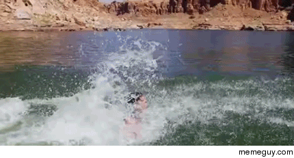

# Delfinen

## Opsætning af database:
1. Kør  for at oprette databasen.
2. Kør  for at fylde databasen med data.
## Opsætning af programmet:
1. Ændre  ved user og password til dit valgte username og password.

## 1. Semesterprojekt forår 2019 - Case: Svømmeklubben Delfinen

Svømmeklubben Delfinen er en mindre klub, der er i vækst. Klubbens ledelse ønsker derfor udviklet et administrativt system til at styre medlemsoplysninger, kontingenter og svømmeresultater.

Det er klubbens formand, der tager sig af nye medlemmer. Ved indmeldelse i klubben registreres diverse stamoplysninger om personen herunder alder.
Desuden registreres oplysninger om personens ønskede aktivitetsform, det vil sige aktivt eller passivt medlemskab, junior- eller seniorsvømmer, motionist eller konkurrencesvømmer.

Klubbens kasserer tager sig af alt vedrørende kontingentbetalin-g. Kontingentets størrelse er betinget af flere forhold. 

For aktive medlemmer er kontingentet for ungdomssvømmere (under 18 år) 1000 kr. årligt, for seniorsvømmere (18 år og over) 1600 kr. årligt. For medlemmer over 60 år gives der 25 % rabat af seniortaksten. For passivt medlemskab er taksten 500 kr. årligt.

Kassereren har ønsket, at systemet kan vise en oversigt over medlemmer, der er i restance.

Konkurrencesvømmerne har tilknyttet en træner. Konkurrencesvømmerne er inddelt i 2 hold efter alder. Ungdomsholdet er for svømmere under 18 år. Seniorholdet er for svømmere på 18 og over. Hver konkurrencesvømmer er desuden registreret i forhold til hvilke svømmediscipliner, svømmeren er aktiv i.

Inden for hver svømmedisciplin registreres den enkelte svømmers bedste træningsresultat og dato løbende. For de svømmere, der har deltaget i konkurrencer, registreres stævne, placering og tid. Det er på baggrund af de enkelte svømmeres resultater, at træneren udtager svømmere til deltagelse i konkurrencer. Træneren ønsker derfor en oversigt, der kan vise klubbens top 5 svømmere inden for hver svømmedisciplin (butterfly, crawl, rygcrawl og brystsvømning).

 
# Projektkrav
## Kravspecifikation
Med udgangspunkt i casen om Svømmeklubben Delfinen skal der udarbejdes en kravspecifikation bestående af: 
1. Domænemodel 
2.	Use case diagram (over systemets funktionalitet)
3.	Kort beskrivelse af use cases
4.	ER diagram (databasen)

## Softwaredesign
I skal designe programmet efter objektorienterede principper med henblik på at koden er:
1.	Læsevenlig
2.	Genbrugbar
3.	Robust
Der skal foreligge en afgrænsning af jeres projekt (en plan for, hvilken use case, som I vil implementere først, og en begrundet prioriteret rækkefølge for øvrige funktionaliteter). 

Det er krav, at I arbejder iterativt og test-driven med design og implementering af hver funktionalitet.

# Software (programmet)

Koden skal som minimum indeholde:
1. Flere klasser, indholdene indkapsling
2. Logisk opdeling af relaterede klasser i packages
3. Relevante datastrukturer såsom Array/ArrayList
4. Nedarvning og/eller interfaces
5. Gemme data i en database (persistens), således, at data bevares/hentes.
6. Simpel tekstbaseret brugergrænseflade
7. Relevante unit tests

## Aflevering 
Følgende afleveres på Moodle senest torsdag d. 9. maj kl 18.00 som enten link til github repository eller en zip-fil indeholdende: 
1.	kildekode og unit tests
2.	En pdf med en kort indledning, kravspecifikation (domæne-diagram, use-case diagram, beskrivelse af ikke funktionelle krav, ER-diagram) samt en kort beskrivelse af afgrænsninger og status for koden.
3.	En sql fil med databasen. Definition og data.
 
# Praktiske oplysninger

Projektet løses i de samme grupper som Marios Pizzabar projektet. 
Alle bør løse en ligelig del af kodearbejdet, hvilket skal fremgå af @author kommentar på Java klasserne.  
Det er en obligatorisk study point opgave på 20 points. 
